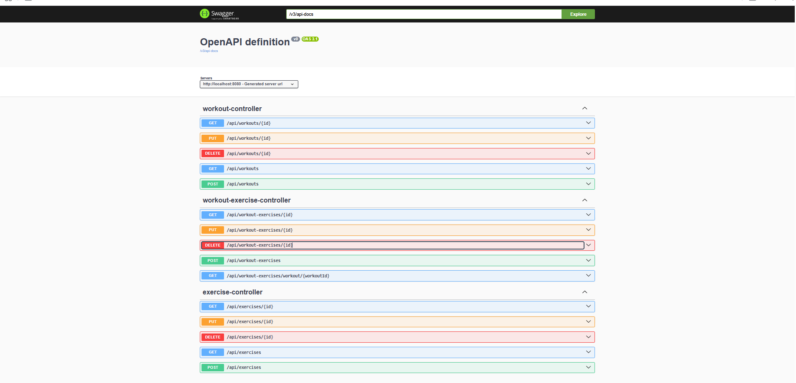

# Gym Tracker API

A REST API for tracking gym workouts built with Spring Boot and PostgreSQL.

## Overview

This project focuses on the backend API of a gym tracking application. It allows users to manage workouts, exercises, and workout entries with sets, reps, and weight.

The current scope is a backend API. The application can be explored through Swagger UI and tested with Postman.

## Features

- CRUD operations for workouts and exercises
- Add exercises to workouts
- Track sets, reps, and weight for each workout exercise
- Request validation and basic error handling
- Swagger UI API documentation

## Tech Stack

- Java 21
- Spring Boot 3
- Spring Data JPA
- PostgreSQL
- Docker Compose
- Swagger / OpenAPI

## Running the Project

### Prerequisites

- Java 21
- Docker

### Start the database

```bash
docker compose up -d
```

### Run the application

Run `GymTrackerApplication.java` from your IDE or use Maven:

```bash
./mvnw spring-boot:run
```

## API Documentation

Swagger UI is available at:

```text
http://localhost:8080/swagger-ui/index.html
```

You can also test the endpoints with Postman.



## Example Endpoints

- `GET /api/workouts`
- `POST /api/workouts`
- `GET /api/exercises`
- `POST /api/exercises`
- `GET /api/workout-exercises/workout/{workoutId}`
- `POST /api/workout-exercises`

## Project Structure

- `controller` - REST endpoints
- `service` - business logic
- `repository` - database access
- `model` - JPA entities
- `dto` - request objects
- `exception` - global exception handling

## Roadmap

- Add authentication
- Add filtering and workout statistics
- Add frontend client in Vue.js
- Improve automated tests
